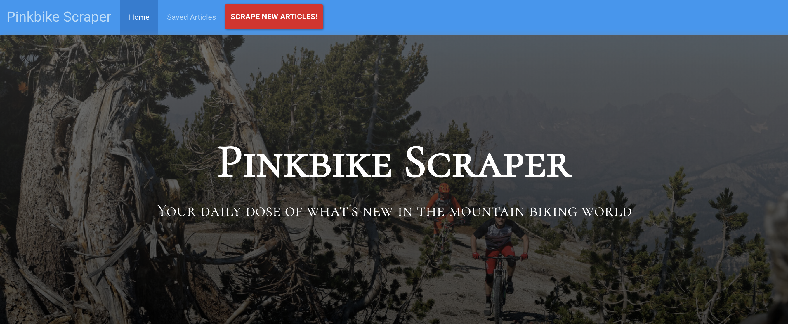
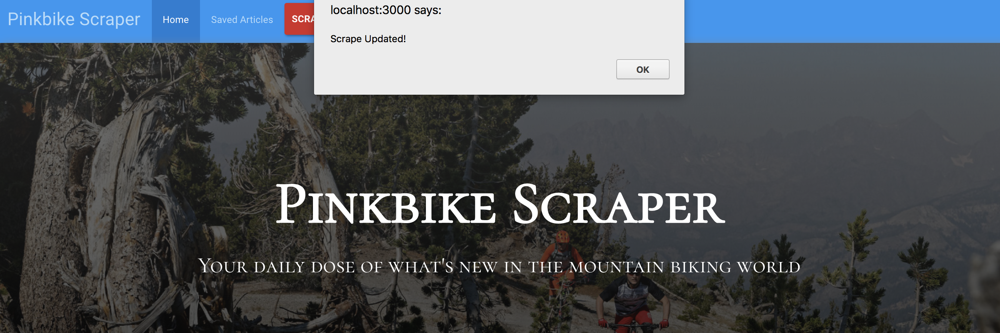
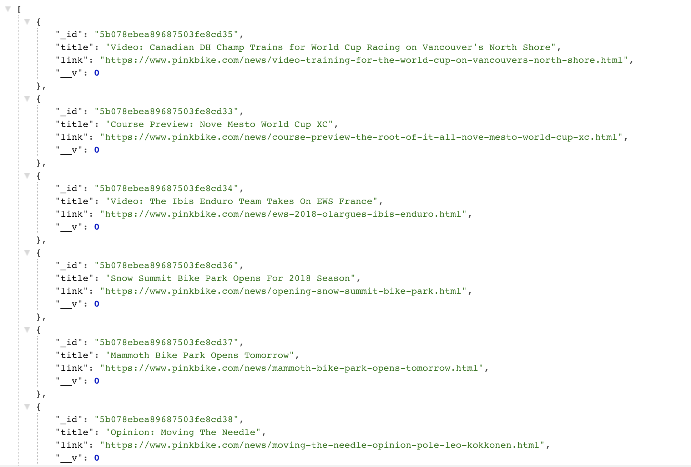
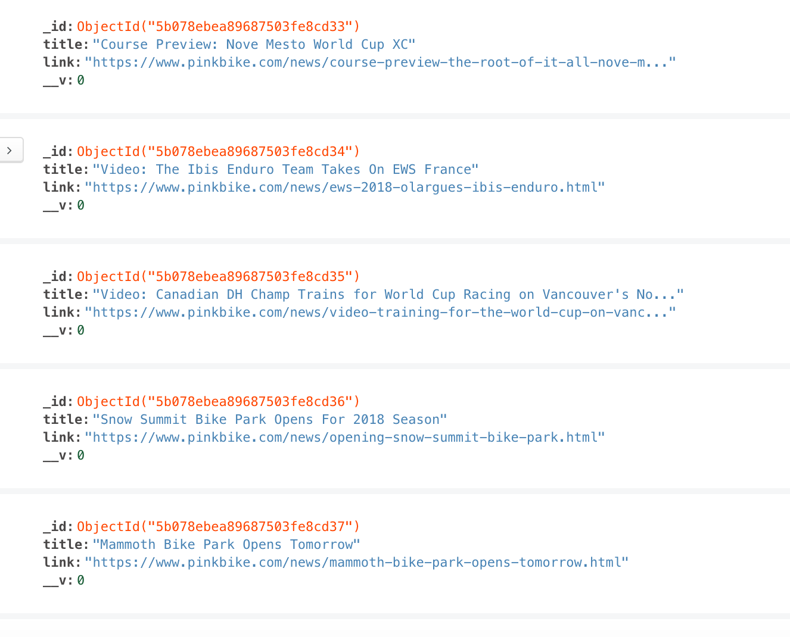

# Pinkbike Scraper
> In the Burger Build App, a user is able to create and devour burger's to a database. 

[![NPM Version][npm-image]][npm-url]

> Check out the functionality live Heroku: https://peaceful-taiga-48560.herokuapp.com/

## Homepage of App

## Rescraping Pinkbike.com

## View Article JSON Page

## View Local Database

## Dependencies

express
mongojs
bodyParser
request
axios
cheerio
mongoose
path

## Meta

> Thomas Seaman – thomasseaman27@gmail.com

[https://github.com/ThomasSeaman](https://github.com/ThomasSeaman)

<!-- Markdown link & img dfn's -->
[npm-image]: https://img.shields.io/npm/v/datadog-metrics.svg?style=flat-square
[npm-url]: https://npmjs.org/package/datadog-metrics
[npm-downloads]: https://img.shields.io/npm/dm/datadog-metrics.svg?style=flat-square